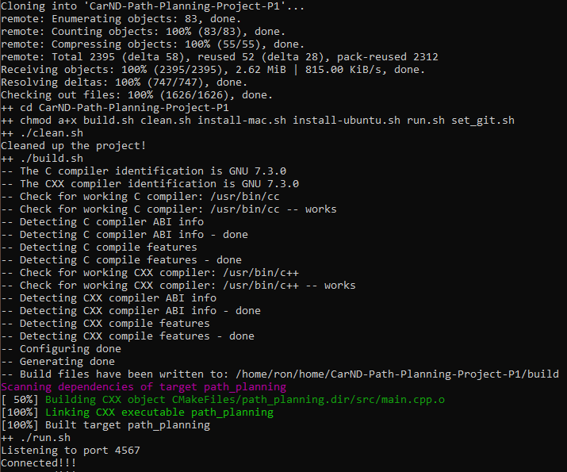
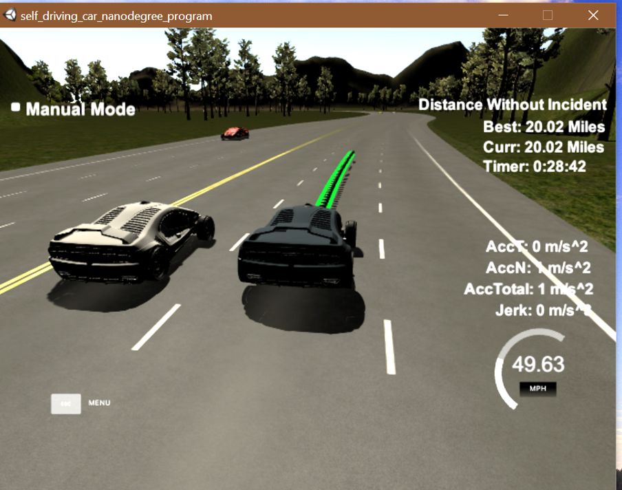

Project 1, Term 3: Path Planning
=======================

Final Result
------------

------------
Compilation
---------

#### The code compiles correctly.

The code compiles correctly wth cmake and make:

---------------
Valid Trajectories
--------

#### The car is able to drive at least 4.32 miles without incident.

- [x] The car is able to drive a very long time without incidents.  The picture above was taken as the car logged over 20 miles without incident.  Furthermore, the car averaged almost 42 mph during those 20+ miles.

#### The car drives according to the speed limit.
- [x] The car doesn't drive faster than the speed limit. Also the car doesn't drive slower than speed limit unless obstructed by traffic.

#### Max Acceleration and Jerk are not Exceeded.
- [x] The car does not exceed a total acceleration of 10 m/s\^2 and a jerk of 10 m/s^3. 

#### The car does not have collisions..
- [x] The car does not come into contact with any of the other cars on the road. 

#### The car stays in its lane, except for the time between changing lanes..
- [x] The car doesn't spend more than a 3 second length out side the lane lanes during changing lanes, and every other time the car stays inside one of the 3 lanes on the right hand side of the road.

#### The car is able to change lanes
- [x] The car is able to smoothly change lanes when it makes sense to do so, such as when behind a slower moving car and an adjacent lane is clear of other traffic.

---------------
Reflection
--------

**The code model for generating paths.**

The code for generating paths is in vehicle.cpp .  A variable named *move* stores the result of the *lanePlanner* function.  *Move* will contain either 4 (change lanes to the right), 0 (do not change lanes), or -4 (change lanes to the left).  From this, *next_ dx* is calculated and sent to function *getXY*.  This function calculates future waypoints using *next_dx* (among other things).  The lane change occurs over time as the *move* variable continues to calculate the same *next_dx* in subsequent frames, thereby creating sufficient waypoints to complete the maneuver.

Vehicle.cpp contains three major functions.  The first, *lanePlanner* determines whether a lane change is both warranted and safe.  A lane change is warranted anytime the Self Drivng Car (SDC) is not in the center lane or anytime the SDC is in the center lane, but slower cars are in front of it.  A lane change is safe when cars in the adjacent lane(s) are more than the *safe_distance* ahead and behind the SDC.  Continuously forcing the SDC to the center lane helps prevent the SDC from being "boxed in" by slower cars.

The second function, *closestVehicle* uses *sensor_fusion* to retrieve the distance and speed of the closest cars (in every lane) ahead and behind the SDC.  *lanePlanner* uses *closestVehicle* to determine whether the center lane has slower cars in the *safe_distance* ahead.  *laneCost* uses *closestVehicle* to assign prohibitively high costs on unsafe lane changes.

The third function, *laneCost* contains the model for selecting the lowest cost lane.  The model assigns a "tax" on lanes 0 and 2.  This incents the SDC to travel in lane 1.  Next, *laneCost* determines whether the lanes have cars in the safety zone.  The safety zone is defined as twice the *safe_distance* either ahead or behind the SDC.  When lanes have cars in the safety zone, prohibitve costs are assigned when the cars are slower than the SDC and taxes are applied when the cars are travelling below the speed limit.  Before returning values to *lanePlanner*, *laneCost* assures the cost for staying in the current lane is not prohibitive, regardless of whether or not cars are in the safety zone.  This assures that *lanePlanner* will always get an acceptable cost option.

